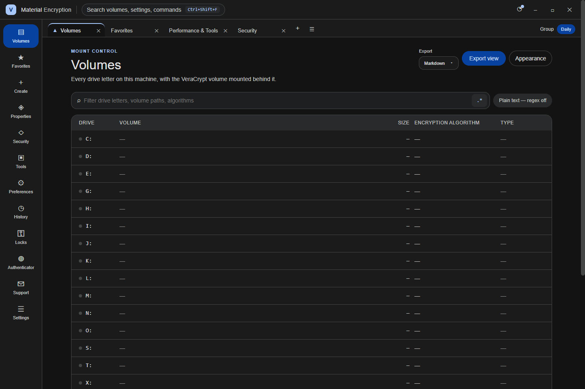

# Material Encryption

A Material Design 3 desktop interface for a locally installed copy of [VeraCrypt](https://www.veracrypt.fr/). Material Encryption keeps VeraCrypt as the cryptographic authority while making its volume, favorites, creation, properties, security, tools, preferences, history, lock, authenticator, support, and settings workflows easier to discover.

> [!IMPORTANT]
> This project is independent from VeraCrypt. It never bundles VeraCrypt, never implements cryptography, and never places a volume password on a process command line. VeraCrypt must be installed separately.

## Install and build

- Run `build.bat` on Windows for a fresh-machine, dependency-restoring build and an optional launch prompt.
- Run `build.bat /s` for a noninteractive build.
- Run `build-installer.bat /s` for the unsigned Squirrel.Windows setup and update package set.

The released Windows installer is intentionally unsigned. Windows may show an unknown-publisher or SmartScreen warning.

Design provenance and coverage

The complete source export in `design/VeraCrypt Material.dc.html` is the renderer source of truth. `scripts/prepare-renderer.mjs` builds the production renderer from it, replaces preview-only secrets and sample state with truthful empty state, removes network fonts, bundles React locally, and adds the hardened desktop bridge. A coverage check guards all 12 designed destinations.

Security boundary

- The renderer is sandboxed, context-isolated, and has no Node.js access.
- The preload exposes a narrow allowlisted API.
- The main process validates drive letters, volume identifiers, paths, export sizes, formats, and external links.
- Volume passwords are entered in VeraCrypt's own prompt; they never enter Material Encryption IPC, settings, logs, exports, or process arguments.
- Destructive controls retain the design's two-key and slider confirmation before the allowlisted operation can run.

See [Security architecture](docs/security/README.md) for failure modes and verification.

Features and documentation

- [Volume operations](docs/volumes/README.md)
- [Design implementation](docs/design/README.md)
- [Security architecture](docs/security/README.md)
- [Build and release](docs/release/README.md)

Real application captures

This capture came from the packaged `app.asar` on an isolated hidden Windows desktop. No mockups or design-preview images are presented as runtime proof. Additional destinations, interaction states, narrow layouts, and light theme are tracked in the release capture matrix.

## Project records

[Roadmap](ROADMAP.md) · [Handoff](HANDOFF.md) · [Security policy](SECURITY.md) · [Contributing](CONTRIBUTING.md) · [Code of conduct](CODE_OF_CONDUCT.md) · [License](LICENSE)

## Shared-instruction mirror

This public repository follows a sanitized mirror of the project's shared engineering requirements in [AGENTS.md](AGENTS.md). Machine-specific locations, private infrastructure, private vocabulary, and credentials are deliberately excluded.
